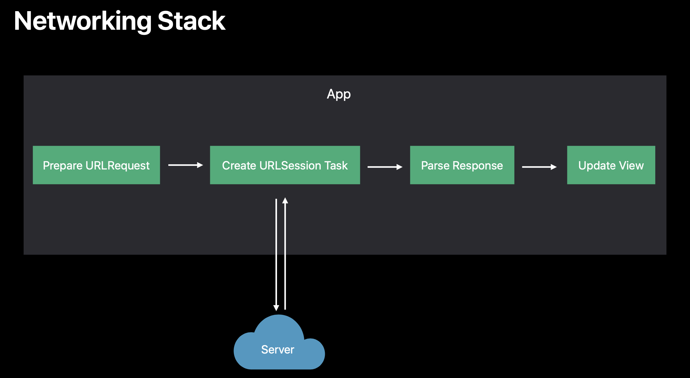
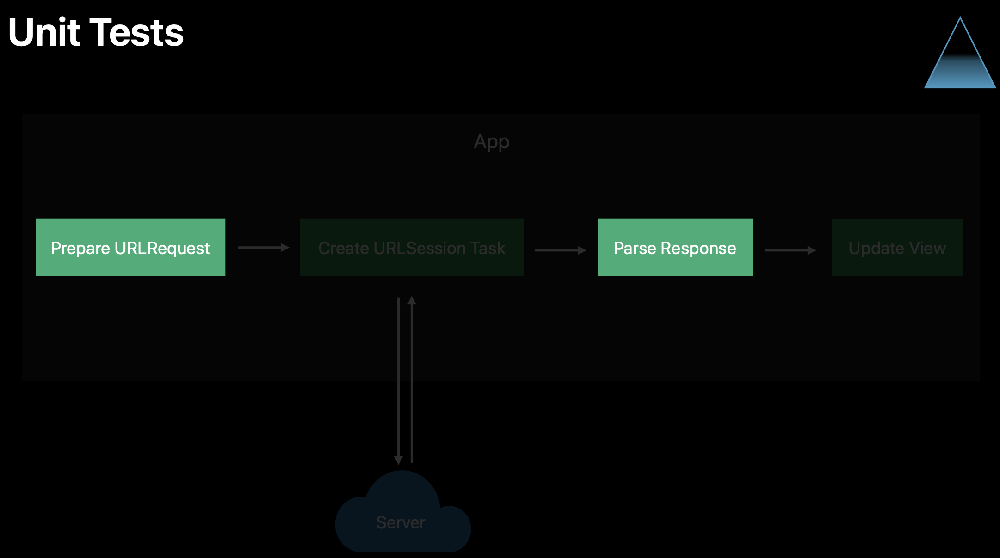
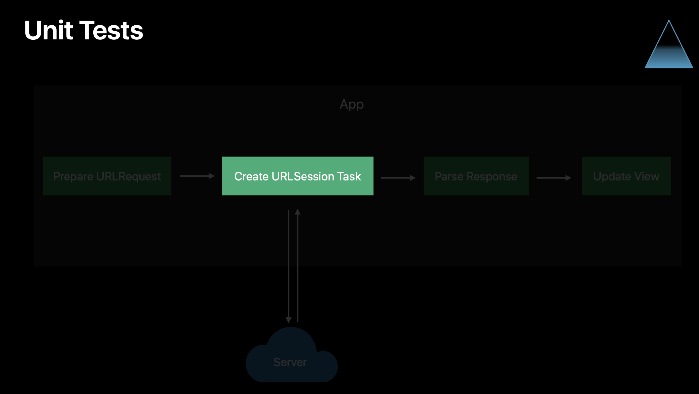
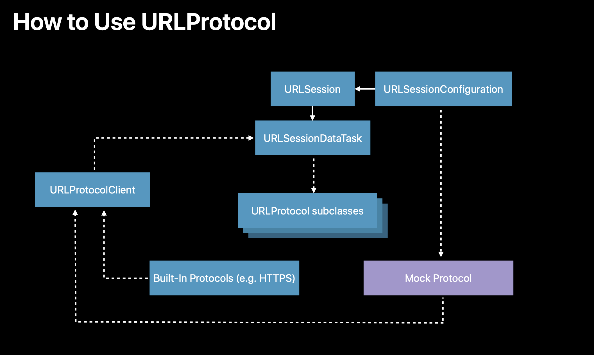

# Network Unit Testing

 Here, we see the high-level data flow involved in making a network request in the app and feeding the data into the UI.
 
 

In an early prototype of the app, we had a method in our view controller that was doing all of this in a single place, and it looked like this. 

```swift
//1
func loadData(near coord: CLLocationCoordinate2D) {
    //2
    let url = URL(string: "/locations?lat=\(coord.latitude)&long=\(coord.longitude)")!
    //3
    URLSession.shared.dataTask(with: url) { data, response, error in
        guard let data = data else { self.handleError(error); return }
        do {
            //4
            let values = try JSONDecoder().decode([PointOfInterest].self, from: data)
            DispatchQueue.main.async {
               //5
                self.tableValues = values
                self.tableView.reloadData()
            }
        } catch {
            self.handleError(error)
        }
    }.resume()
}
```
1. The method takes a parameter with the user's location 
2. Construct a URL for a service API endpoint with a location as query parameters
3. Then it uses Foundation's URLSession APIs to make a data task for a get request to that URL
4. Then the server responds, it would unwrap the data, decode it using foundation's JSONDecoder API, into an array of point of interest values, which is a struct that we declared elsewhere and conforms the decodable protocol.
5. Stores the responce into a property to drive a table view implementation

## The Problem
Putting all of this code together we harm the maintability and testability. What we really want to be able to do, is write focus unit tests for each of these pieces of the flow. (diagram)

Let's first write unit tests for the request preparation and response parsing steps.


In order to make the above code more testable, we started by pulling it out of the view controller and made two methods on this dedicated PointsOfInterestRequest type. We introduce two decoupled methods that each take some values as input and transform them into some output. This makes it very straightforward for us to write a focused unit test for the code.

### Refactoring code (1/2)

```swift
struct PointsOfInterestRequest: APIRequest {
    
    func makeRequest(from coordinate: CLLocationCoordinate2D) throws -> URLRequest {
        
        guard CLLocationCoordinate2DIsValid(coordinate) else {
            throw RequestError.invalidCoordinate
        }

        var components = URLComponents(string: "https://example.com/locations")!
        components.queryItems = [
            URLQueryItem(name: "lat", value: "\(coordinate.latitude)"),
            URLQueryItem(name: "long", value: "\(coordinate.longitude)")
        ]
        return URLRequest(url: components.url!)
    }
    
    func parseResponse(data: Data) throws -> [PointOfInterest] {
        return try JSONDecoder().decode([PointOfInterest].self, from: data)
    }

}
```
### Test code
The above code is very straightforward and we are able to write a focused unit test. We are going to test `makeRequest` method by making a fake location, passing it to the method and making some assertions about its return value. Similarly, we can test the response parsing by passing in some mock JSON and making assertions about the parsed result.

```swift
class PointOfInterestRequestTests: XCTestCase {
    
    let request = PointsOfInterestRequest()
    
    func testMakingURLRequest() throws {
        let coordinate = CLLocationCoordinate2D(latitude: 37.3293, longitude: -121.8893)
        let urlRequest = try request.makeRequest(from: coordinate)
        XCTAssertEqual(urlRequest.url?.scheme, "https")
        XCTAssertEqual(urlRequest.url?.host, "example.com")
        XCTAssertEqual(urlRequest.url?.query, "lat=37.3293&long=-121.8893")
    }
    
    func testParsingResponse() throws {
        let jsonData = "[{\"name\":\"My Location\"}]".data(using: .utf8)!
        let response = try request.parseResponse(data: jsonData)
        XCTAssertEqual(response, [PointOfInterest(name: "My Location")])
    }
}
```
### Refactoring code (2/2)

Lets see the code interacting with URLSession

 We will make an APIRequest protocol with methods matching the signature of the methods from the request type that we described above. This will be used by an APIRequestLoader class.
 
 ``` swift
 protocol APIRequest {
    
    associatedtype RequestDataType
    associatedtype ResponseDataType
    
    func makeRequest(from data: RequestDataType) throws -> URLRequest
    func parseResponse(data: Data) throws -> ResponseDataType
}


class APIRequestLoader<T: APIRequest> {
    let apiRequest: T
    let urlSession: URLSession
    
    init(apiRequest: T, urlSession: URLSession = .shared) {
        self.apiRequest = apiRequest
        self.urlSession = urlSession
    }
    
    
    func loadAPIRequest(requestData: T.RequestDataType,
                        completionHandler: @escaping (T.ResponseDataType?, Error?) -> Void) {
        do {
            let urlRequest = try apiRequest.makeRequest(from: requestData)
            urlSession.dataTask(with: urlRequest) { data, response, error in
                guard let data = data else { return completionHandler(nil, error) }
                do {
                    let parsedResponse = try self.apiRequest.parseResponse(data: data)
                    completionHandler(parsedResponse, nil)
                } catch {
                    completionHandler(nil, error)
                }
            }.resume()
        } catch { return completionHandler(nil, error) }
        
    }
}
```
The `APIRequestLoader` class has a `loadAPIRequest` method which uses that apiRequest value to generate a URL request. Feed that into the urlSession, and then use the apiRequest again to parse in the response. The above code is now testable but another thing that we would like to be able to test is if our interaction with the `URLSession` APIs is correct. URLSession provides a high level API for apps to use to perform network requests.

## Mock URLProtocol

 

`URLProtocol` is designed to be subclassed giving an extensibility point for the URL loading system.
Foundation provides built-in protocols subclasses for common protocols like HTTPS.
But we can override these in our tests by providing a mock protocol that lets us make assertions about requests that are coming out and provide mock responses. `URLProtocol` communicates progress back to the system via the URLProtocolClient protocol.

```swift
class MockURLProtocol: URLProtocol {
    
    static var requestHandler: ((URLRequest) throws -> (HTTPURLResponse, Data))?
    
    override func startLoading() {
        
        guard let handler = MockURLProtocol.requestHandler else {
            XCTFail("Received unexpected request with no handler set")
            return
        }
        
        do {
            let (response, data) = try handler(request)
            client?.urlProtocol(self, didReceive: response, cacheStoragePolicy: .notAllowed)
            client?.urlProtocol(self, didLoad: data)
            client?.urlProtocolDidFinishLoading(self)
        } catch {
            client?.urlProtocol(self, didFailWithError: error)
        }
        
    }
    
    override func stopLoading() {
        // Required by the superclass.
    }
    
    override class func canInit(with request: URLRequest) -> Bool {
        return true
    }
    
    override class func canonicalRequest(for request: URLRequest) -> URLRequest {
        return request
    }
}
```

### Test code

```swift
class APILoaderTests: XCTestCase {
    
    var loader: APIRequestLoader<PointsOfInterestRequest>!
    
    override func setUp() {
        
        let request = PointsOfInterestRequest()
        
        
        let configuration = URLSessionConfiguration.ephemeral
        configuration.protocolClasses = [MockURLProtocol.self]
        let urlSession = URLSession(configuration: configuration)
        
        loader = APIRequestLoader(apiRequest: request, urlSession: urlSession)
        
    }
    
    func testLoaderSuccess() {
        
        let inputCoordinate = CLLocationCoordinate2D(latitude: 37.3293, longitude: -121.8893)
        let mockJSONData = "[{\"name\":\"MyPointOfInterest\"}]".data(using: .utf8)!
        MockURLProtocol.requestHandler = { request in
            print("request = \(request)")
            XCTAssertEqual(request.url?.query?.contains("lat=37.3293"), true)
            return (HTTPURLResponse(), mockJSONData)
        }
        
        let expectation = XCTestExpectation(description: "response")
        loader.loadAPIRequest(requestData: inputCoordinate) { pointsOfInterest, error in
            XCTAssertEqual(pointsOfInterest, [PointOfInterest(name: "MyPointOfInterest")])
            expectation.fulfill()
        }
        wait(for: [expectation], timeout: 1)
    }
}
```

We set up by making an APIRequestLoader instance, configure it with a request type and a URLSession that's been configured to use our URLProtocol. In the test body, we set a requestHandler on the MockURLProtocol, making assertions about the request that's going out, then providing a stub response. Then we can call loadAPIRequest, waiting for the completion block to be called, making assertions about the parsed response.

In this example we saw hot to structure our code in order to write testable code. Also we saw how URLProtocol can be used as a tool for mocking network requests.

## Links
[WWDC 2018](https://developer.apple.com/videos/play/wwdc2018/417/?time=542)
